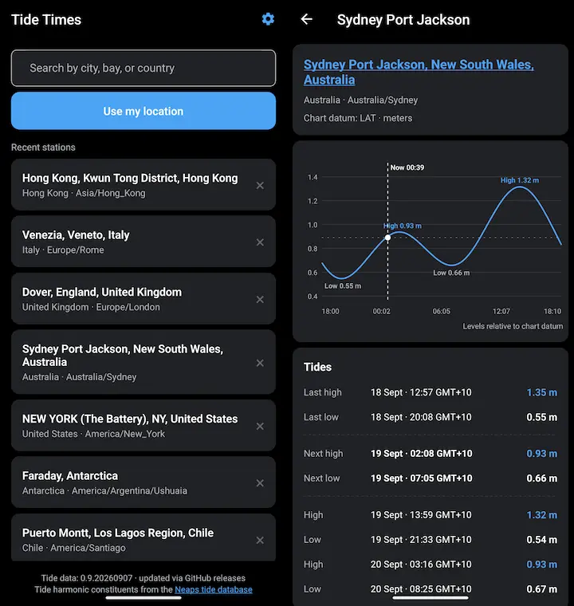

# Tide Times

[](https://github.com/DigitallyRefined/tide-times/releases)
[](https://github.com/DigitallyRefined/tide-times/releases)

A React Native Expo app for browsing tide stations and viewing tide predictions. 
Search for a station by name or country, find the closest stations to your location,
and open a station to see its tide curve, high/low times, and current water level.



## 📲 Install

<div align="center">
<a href="https://github.com/DigitallyRefined/tide-times/releases">
</a>

<a href="https://github.com/ImranR98/Obtainium" target="_blank">
</a>
</div>

## Features

- Search reference tide stations by name or country
- "Use my location" to list the 10 nearest stations
- Recent stations, persisted on device
- Per-station tide graph with high/low events and current level
- Automatic tide-data updates from GitHub releases (native), bundled snapshot on web
- Settings page to save an optional GitHub access token for higher API rate limits

## Tech stack

- [Expo SDK 57](https://docs.expo.dev/versions/v57.0.0/) / React Native 0.86 / React 19
- [Expo Router](https://docs.expo.dev/versions/v57.0.0/sdk/router/) (file-based routing in `src/app`)
- [`@neaps/tide-predictor`](https://github.com/openwatersio/neaps) for harmonic tide predictions
- [`react-native-svg`](https://docs.expo.dev/versions/v57.0.0/sdk/svg/) for the tide graph

## Requirements

- Node.js 22.13.x or newer (required by Expo SDK 57)
- npm
- [Docker](https://docs.docker.com/get-docker/) to build the Android APKs
- For device/simulator development: Android Studio (Android) or Xcode (iOS)

## Getting started

```sh
npm install
npm start          # start the Expo dev server

npm run android    # open on an Android device/emulator
npm run ios        # open on iOS
npm run web        # run in the browser
npm run lint       # eslint via expo lint
```

## Project structure

```
src/
  app/                 Expo Router routes
    _layout.tsx        Root layout
    index.tsx          Station search / list screen
    settings.tsx       Settings (GitHub access token)
    station/[id].tsx   Station detail + tide graph
  components/          UI components (search input, tide graph)
  constants/theme.ts   Colors, spacing, fonts
  hooks/               Theme hooks
  lib/
    tide-database.ts   Downloads, caches and parses the tide database
    tcd-parser.ts      Parser for the Neaps .tcd binary format
    tide-time.ts       Timezone-aware time formatting
    recent-stations.ts Recent-station persistence
    github-token.ts    Secure storage of the GitHub access token
public/
  neaps-metric.tcd     Tide-data snapshot used by the web build
```

## Tide data

Tide harmonic constituents from the [Neaps tide database](https://github.com/openwatersio/tide-database).
Native builds query the latest GitHub release and download the `neaps-*-metric.tcd`
asset into app documents (native) or IndexedDB (web). GitHub release assets are not
CORS-readable by browsers, so the web build loads the snapshot committed at
`public/neaps-metric.tcd` (see `src/lib/tide-database.ts`). Bump that file and
`WEB_TCD_VERSION` when you want to ship newer data to the web.

### GitHub access token (rate-limited downloads)

Downloading the tide database uses the GitHub REST API
(`api.github.com/repos/openwatersio/tide-database/releases/latest`). Without
authentication GitHub allows 60 requests per hour **per IP address**. If you are
behind a shared or mobile network connection (as most phone users are), that
limit is quickly exhausted and the download fails with `HTTP 403`.

To fix this you can save a [GitHub personal access token](https://github.com/settings/tokens)
in the app's **Settings** page (available from the header on the search screen):

1. Open https://github.com/settings/tokens (Settings → Developer settings →
   Personal access tokens).
2. Start with the
   [fine-grained personal access token](https://docs.github.com/en/authentication/keeping-your-account-and-data-secure/managing-your-personal-access-tokens)
   workflow. Choose only the repositories you need (e.g.
   `openwatersio/tide-database`) and grant at minimum `Contents: Read-only`, or
   keep it to no repository access at all — the app only needs the raised core
   rate limit. A classic token with no scopes also works.
3. Paste the token into the settings screen and save.

The token raises the limit to 5,000 requests per hour and authenticates the
release-asset downloads too. Including it in every GitHub API request happens in
`src/lib/tide-database.ts` via a `Bearer` header.

The token never leaves the device:

- It is stored with `expo-secure-store` — the Android Keystore / iOS Keychain —
  see `src/lib/github-token.ts`. It is not sent to any server other than GitHub.
- On Android it is excluded from Auto Backup / device-to-device transfer by
  `plugins/withAndroidBackupRules.js` (the `SecureStore` shared preferences are
  excluded from both `data_extraction_rules.xml` and `backup_rules.xml`).
- `expo-secure-store` is registered with `configureAndroidBackup: false` in
  `app.json` so its built-in backup wiring does not overwrite the app's custom
  rules; exclusion is handled by the app's own backup config plugin.
- The web build never uses the token: the browser version loads the bundled
  snapshot and SecureStore has no web implementation (the setting is hidden
  there too).

If you don't save a token the app still works — downloads just occasionally fail
until the hourly limit resets. Removing the stored token from the settings page
deletes it from the keychain/keystore.

## Build the Android APKs (Docker)

Debug and release APKs are built with Gradle inside Docker using
[`build-android.sh`](./build-android.sh) and [`Dockerfile.android`](./Dockerfile.android).
Docker is the only host requirement — no Node, JDK, or Android SDK install is
needed. The first run builds the image and downloads Gradle dependencies, which
takes a while; later runs reuse the cached image and the local caches in
`.cache/` (git-ignored).

### Debug APK (default)

```sh
./build-android.sh
```

The debug APK is written to `build/apk/app-debug.apk`.

### Signed release APK

Create a release keystore with `keytool` (available from any JDK, for example via
the build image). Keep it safe — if you lose it you cannot update an
already-installed app.

```sh
mkdir -p android/keystores

keytool \
  -genkey -v \
  -storetype JKS \
  -keyalg RSA \
  -keysize 2048 \
  -validity 10000 \
  -storepass "$KEYSTORE_PASSWORD" \
  -keypass "$KEY_PASSWORD" \
  -alias "$KEY_ALIAS" \
  -keystore android.keystore \
  -dname "CN=com.github.digitallyrefined.tidetimes,OU=,O=,L=,S=,C=US"
```

Store the credentials in an untracked `keystore.properties`:

```properties keystore.properties
storeFile=android.keystore
storePassword=YOUR_KEYSTORE_PASSWORD
keyAlias=YOUR_KEY_ALIAS
keyPassword=YOUR_KEY_PASSWORD
```

Then build with the release flag:

```sh
./build-android.sh --release \
  --keystore android.keystore \
  --properties keystore.properties
```

The signed APK is written to `build/apk/app-release.apk`. After a successful
release build the script verifies the APK and prints its signing information
(signing schemes, certificate DN and digests, key algorithm/size).

The `storeFile` value in your properties file is ignored: the script mounts the
keystore into the container and rewrites `storeFile` to its path inside the
container. Since `expo prebuild` regenerates the git-ignored `android/` directory
(and wipes manual Gradle edits), the script also runs
[`scripts/patch-release-signing.js`](./scripts/patch-release-signing.js) to point
the release build type at your keystore.

### Options

- `--clean` — regenerate the native `android/` project before building. Use this
  after changing native configuration (`app.json`, config plugins, native
  dependencies).
- `-h`, `--help` — show usage.

Do **not** commit `keystore.properties` or the keystore. The repo already ignores
`*.jks` and `/android`.

### Install

With `adb` on your `PATH` and a device connected over USB debugging:

```sh
adb install -r build/apk/app-release.apk
```

Or copy the APK to the device and open it to install. To update an already-installed
build, the APK must be signed with the same keystore.

## 🤖 AI generated code disclaimer

Some of the code in this repository may be generated with the assistance of AI tools. All changes are reviewed and tested on a real device with a human in the loop before being released.

## License

See [LICENSE](./LICENSE).
